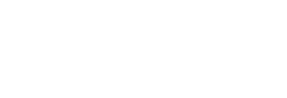

## What is Norse?

. . .

::: {.f1 .green}
Spiking Neuron Primitives implemented for PyTorch
:::

##

:::: {.flex .flex-column .flex-row-l .flex-wrap-l .mt5 .fragment}

::: {.fl .w-33 .tc .calibre .normal .f2 .mt3}
::: {.mw7}
{.h5 .rotate-90}

Blazing fast 

:::
:::


::: {.fl .w-33 .tc .calibre .normal .f2 .mt3 .fragment}
::: {.mw7}
{.h5 .rotate-45}

Feels amazing to use

:::
:::

::: {.fl .w-33 .tc .calibre .normal .f2 .mt3 .fragment}
::: {.mw7}
{.h5 .rotate-90}

Quick to get started
:::
:::

::::


##

:::: {.flex .flex-column .flex-row-l .flex-wrap-l}

::: {.fl .w-25 .tc .calibre .normal .f}

{.h5 .rotate-90}

Blazing fast

:::

::: {.fl .w-75 .tc .calibre .normal .f1}


::: {.incremental .lh-copy .mt5 .fl .pl5}
- PyTorch already takes care of most of the work.
- Implementation is performance aware.
- Custom code for selected operations.
::: 


:::
:::


##

:::: {.flex .flex-column .flex-row-l .flex-wrap-l}

::: {.fl .w-25 .tc .calibre .normal .f}

{.h5 .rotate-45}

Feels amazing to use

:::

::: {.fl .w-75 .tc .calibre .normal .f1}


::: {.incremental .lh-copy .mt5 .fl .pl5 }
- Complexity is revealed gradually.
- Sensible defaults.
- Easily customisable and extensible.
::: 


:::
:::


##

:::: {.flex .flex-column .flex-row-l .flex-wrap-l}

::: {.fl .w-25 .tc .calibre .normal .f}

{.h5 .rotate-90}

Quick to get started

:::

::: {.fl .w-75 .tc .calibre .normal .f1}

::: {.fl .ph5}
Install the PIP or conda package: 

`pip install norse`
:::

::: {.incremental .lh-copy .mt5 .fl .ph5}
  
- Try out one of the [jupyter notebooks](https://norse.github.io/notebooks/).
- Read our [interactive documentation](https://norse.github.io/norse/).
- End-to-end [example tasks](https://github.com/norse/norse/tree/main/norse/task).
::: 


:::
:::


## Event-based processing with Norse

- Asynchronous and parallel <span class="fragment">- perfect for neuromorphics</span>


## Event-based neuron models

::: {.fl .w-50 .tc .calibre .normal .f1 .bg-washed-blue}


:::

::: {.fl .w-10 .tc .calibre .normal .f1 }

<br/>

:::

::: {.fl .w-40 .tc .calibre .normal .f1 .bg-washed-blue}


:::

::: {.fl .w-100 .tc .calibre .normal .f1 .fragment}


:::


## Event-based edge detector


::: {.fl .w-20 .tc .calibre .normal .f1}


<!-- Source: https://github.com/vdumoulin/conv_arithmetic/blob/master/README.md -->

:::

::: {.fl .w-10 .tc .calibre .normal .f1 }

<br/>

:::

::: {.fl .w-70 .tc .calibre .normal .f1 .fragment}

<br/>

```{.python data-line-numbers="1|2|4,7|5|6|4-7" data-id="code-animation"}
import torch
from norse.torch import LIFRefracCell

model = nn.Sequential(
    LIFRefracCell(),
    torch.nn.Conv2d(1, 1, 5),
)
```
:::

## 

<video width="70%" controls loop>
      <source src="https://jepedersen.dk/slides/202209_neurotech/2209-edge-detection.mp4" type="video/mp4">
</video>

## Event-based streaming with Norse

- Real-time streaming with AEStream
  - `with FileInput(...) as file: ...`

<br/>

::: {.fragment}
- Real-time spiking neuron dynamics with Norse
  - `lif_network(file.read())`
:::

<br/>

::: {.fragment}
- Future projects
  - Control systems
  - Plasticity
  - Meta learning

:::

## Deep Learning with Norse

## 

:::: {.flex .flex-column .flex-row-l .flex-wrap-l .mt5}

::: {.fl .w-33 .tc .calibre .normal .f2 .mt3 .fragment}
::: {.mw7}
{.h5 .rotate-90}

Familiar to ML researchers

:::
:::


::: {.fl .w-33 .tc .calibre .normal .f2 .mt3 .fragment}
::: {.mw7}
{.h5 .rotate-90}

Compose primitives freely

:::
:::

::: {.fl .w-33 .tc .calibre .normal .f2 .mt3 .fragment}
::: {.mw7}
{.h5 .rotate-90}

Extensible by everyone
:::
:::

::::

## 

:::: {.flex .flex-column .flex-row-l .flex-wrap-l}

::: {.fl .w-25 .tc .calibre .normal}

{.rotate-90 .h5}

Familiar to ML researchers

:::
::: {.fl .w-75 .tc .calibre .normal .f1}

::: {.incremental .lh-copy .mt5 .fl .ph5}
- Build models like you would in PyTorch.
- Use dataloaders and training frameworks as is.
- Mix ANN and SNN layers.
::: 

:::
:::


## {data-auto-animate=""}

:::: {.flex .flex-column .flex-row-l .flex-wrap-l}

::: {.fl .w-25 .tc .calibre .normal .f}

{.h5 .rotate-90}

Compose primitives freely

:::
::: {.fl .w-75 .h-100 .tl .normal .f1 .tc}


::: {.ph5 .fragment .tl}
Convolutional Neural Network
:::

::: {.fragment}
```{.python data-line-numbers="1|6-17|9,12,16" data-id="code-animation"}
import torch, torch.nn as nn


model = nn.Sequential(
    nn.Conv2d(1, 20, 5, 1),
    nn.ReLU(),
    nn.MaxPool2d(2, 2),
    nn.Conv2d(20, 50, 5, 1),
    nn.ReLU(),
    nn.MaxPool2d(2, 2),
    nn.Flatten(),
    nn.Linear(800, 10)
    nn.Identity()
)
```
:::


:::
:::

## {data-auto-animate=""}

:::: {.flex .flex-column .flex-row-l .flex-wrap-l}

::: {.fl .w-25 .tc .calibre .normal .f}

{.h5 .rotate-90}

Compose primitives freely

:::
::: {.fl .w-75 .h-100 .tl .normal .f1 .tc}


::: {.ph5 .tl}
Convolutional Spiking Neural Network
:::


```{.python data-line-numbers="3-5,9,12,16,7,17|8,10,11,13,14,15|9,12,16" data-id="code-animation"}
import torch, torch.nn as nn

from norse.torch import LICell
from norse.torch import LIFCell
from norse.torch import SequentialState

model = SequentialState(
    nn.Conv2d(1, 20, 5, 1),
    LIFCell(),
    nn.MaxPool2d(2, 2),
    nn.Conv2d(20, 50, 5, 1),
    LIFCell(),
    nn.MaxPool2d(2, 2),
    nn.Flatten(),
    nn.Linear(800, 10),
    LICell(),
)
```


:::
:::

## {data-auto-animate=""}

:::: {.flex .flex-column .flex-row-l .flex-wrap-l}

::: {.fl .w-25 .tc .calibre .normal .f}

{.h5 .rotate-90}

Compose primitives freely

:::
::: {.fl .w-75 .h-100 .tl .normal .f1 .tc}


::: {.ph5 .tl}
Convolutional Spiking Neural Network
:::

```{.python data-line-numbers="4,9,12" data-id="code-animation"}
import torch, torch.nn as nn

from norse.torch import LICell
from norse.torch import AdexCell
from norse.torch import SequentialState, Lift

model = SequentialState(
    nn.Conv2d(1, 20, 5, 1),
    AdexCell(),
    nn.MaxPool2d(2, 2),
    nn.Conv2d(20, 50, 5, 1),
    AdexCell(),
    nn.MaxPool2d(2, 2),
    nn.Flatten(),
    nn.Linear(800, 10),
    LICell(),
)
```

:::
:::

## {data-auto-animate=""}

:::: {.flex .flex-column .flex-row-l .flex-wrap-l}

::: {.fl .w-25 .tc .calibre .normal .f}

{.h5 .rotate-90}

Compose primitives freely

:::
::: {.fl .w-75 .h-100 .tl .normal .f1 .tc}


::: {.ph5 .tl}
Convolutional Spiking Neural Network
:::

```{.python data-line-numbers="4,9,12" data-id="code-animation"}
import torch, torch.nn as nn

from norse.torch import LICell
from norse.torch import IAFCell
from norse.torch import SequentialState

model = SequentialState(
    nn.Conv2d(1, 20, 5, 1),
    IAFCell(),
    nn.MaxPool2d(2, 2),
    nn.Conv2d(20, 50, 5, 1),
    IAFCell(),
    nn.MaxPool2d(2, 2),
    nn.Flatten(),
    nn.Linear(800, 10),
    LICell(),
)
```

:::
:::


## {data-auto-animate=""}

:::: {.flex .flex-column .flex-row-l .flex-wrap-l}

::: {.fl .w-25 .tc .calibre .normal .f}

{.h5 .rotate-90}

Compose primitives freely

:::
::: {.fl .w-75 .h-100 .tl .normal .f1 .tc}


::: {.ph5 .tl}
Convolutional Spiking Neural Network
:::

```{.python data-line-numbers="5,8,10,11,13-15|3,4,9,12,16" data-id="code-animation"}
import torch, torch.nn as nn

from norse.torch import LI
from norse.torch import LIF
from norse.torch import Lift

model = nn.Sequential(
    Lift(nn.Conv2d(1, 20, 5, 1)),
    LIF(),
    Lift(nn.MaxPool2d(2, 2)),
    Lift(nn.Conv2d(20, 50, 5, 1)),
    LIF(),
    Lift(nn.MaxPool2d(2, 2)),
    Lift(nn.Flatten()),
    Lift(nn.Linear(800, 10)),
    LI(),
)
```

:::
:::


## 

:::: {.flex .flex-column .flex-row-l .flex-wrap-l}

::: {.fl .w-25 .tc .calibre .normal .f}

{.h5 .rotate-90}

Extensible by everyone

:::
::: {.fl .tl .w-75 .tc .normal .f1}


::: {.fl .lh-copy .ph5 .fragment}
Join us on [github](https://github.com/github/) and [discord](https://discord.gg/7fGN359)!
:::

::: {.incremental .lh-copy .mt5 .fl .ph5}
- Implementation is (mostly) in Python.
- Simple neuron models can be added quickly.
- *Open* and *welcoming* community.
::: 

:::
:::


# Workshop

## 

:::: {.flex .flex-column .flex-row-l .flex-wrap-l}

::: {.fl .w-50 .calibre .tc .normal .f1}

{.h6 .rotate-90}

Event streaming

:::
::: {.fl .w-50 .calibre .tc .normal .f1}

{.h6}

Deep Learning

:::
:::

## Schedule

::: {.fragment}
- 9:00 - 9:30:  Presentation + Questions (<- we are here)
:::
::: {.fragment}
- 9:30 - 10:15: Workshop 1/2
    - {.h2 .v-mid .rotate-90} Event streaming (Jens)
    - {.h2 .v-mid} Deep learning (Christian)
:::
::: {.fragment}
- 10:15 - 10:30: Break
:::
::: {.fragment}
- 10:30 - 11:15: Workshop 2/2
    - {.h2 .v-mid .rotate-90} Event streaming (Jens)
    - {.h2 .v-mid} Deep learning (Christian)
:::
::: {.fragment}
- 11:15 - 11:30: Q&A
:::

## Workshop 1: Event streaming

## Goals


## Workshop 2: Deep Learning

## Goals


# Let's get started!

## Funding & Acknowledgements

:::: {.flex .flex-column .flex-row-l .flex-wrap-l}

::: {.fl .w-25 .calibre .tc .normal .f1 .fragment .pa2}

[Electronic Vision(s)](https://github.com/electronicvisions)

{style="width: 100%"}


:::

::: {.fl .w-25 .calibre .tc .normal .f1 .fragment .pa2}

{style="width: 100%"}


:::


::: {.fl .w-25 .calibre .tc .normal .f1 .fragment .pa2}

{style="width: 60%"}


:::


::: {.fl .w-25 .calibre .tc .normal .f1 .fragment .pa2}


::: {.w-100}
{.h4 .rotate-90} {.h4 .rotate-90}  {.h4 .rotate-90}


::: { .tc .gray .f3}

Icons by Thought Machine

© 2022 Thought Machine

Released under [CC-BY-v4](https://creativecommons.org/licenses/by/4.0/)
:::
:::

:::


:::


::: { .tl .gray .f3}

The research has received funding from the EC Horizon 2020 Framework Programme under Grant Agreements 785907 and 945539 (HBP) and by the Deutsche Forschungsgemeinschaft (DFG, German Research Fundation) under Germany's Excellence Strategy EXC 2181/1 - 390900948 (the Heidelberg STRUCTURES Excellence Cluster).

:::